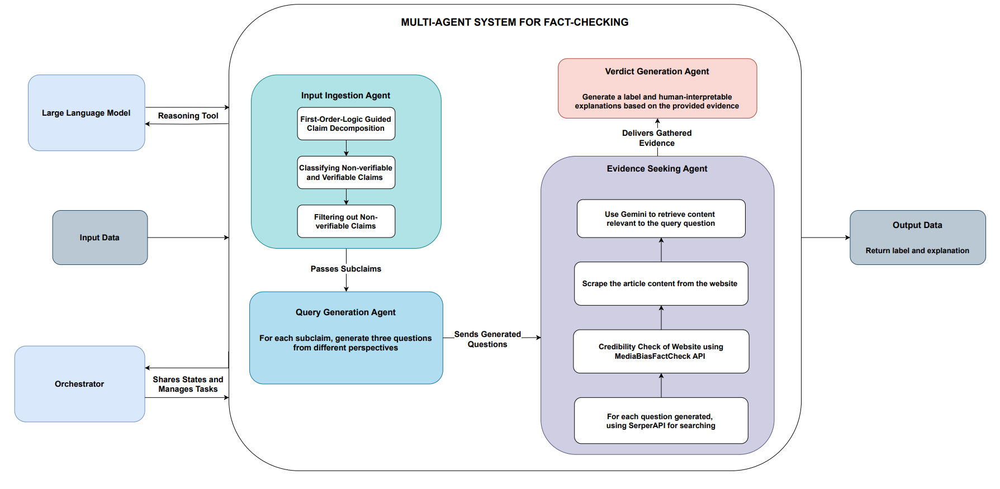

# Towards Robust Fact-Checking: A Multi-Agent System with Advanced Evidence Retrieval

A sophisticated multi-agent fact-checking system that combines advanced evidence retrieval techniques to verify factual claims across diverse domains.



## Contributors
- Tam Trinh
- Manh Nguyen
- Hy Truong Son (Correspondent / PI)
## 📋 Requirements

- Python 3.11 or higher

## 🛠️ Installation

1. **Clone the repository**
   ```bash
   git clone https://github.com/your-username/FactAgent.git
   cd FactAgent
   ```

2. **Create a virtual environment**
   ```bash
   python3.11 -m venv venv
   source venv/bin/activate  # On Windows: venv\Scripts\activate
   ```

3. **Install dependencies**
   ```bash
   pip install -r requirements.txt
   ```

4. **Set up environment variables**
   ```bash
   cp .env.example .env
   # Edit .env with your API keys and configuration
   ```

## 📁 Project Structure

```
FactAgent/
├── src/
│   ├── main_agent.py          # Main FactAgent implementation
│   ├── run_experiments.py     # Experiment runner
│   ├── evaluate.py            # Evaluation utilities
│   ├── utils.py               # Utility functions
│   ├── experiments/           # Different reasoning methods
│   │   ├── cot.py            # Chain-of-Thought reasoning
│   │   ├── direct.py         # Direct reasoning
│   │   ├── folk.py           # Folk reasoning
│   │   └── sase.py           # SASE reasoning
│   ├── prompts/              # Prompt templates
│   │   ├── evidence_seeking.py
│   │   ├── input_ingestion.py
│   │   ├── query_generation.py
│   │   └── verdict_prediction.py
│   └── tools/                # Tools and utilities
│       ├── retrieve.py       # Evidence retrieval
│       └── media_bias_data.json
├── data/                     # Test datasets
│   ├── FeverousDev/
│   ├── HoVerDev/
│   └── SciFact-Open/
├── requirements.txt
└── README.md
```

## 🎯 Quick Start

### Basic Usage

```python
from src.main.python.main_agent import FactAgent

# Initialize the agent
agent = FactAgent(dataset="fever")

# Verify a claim
claim = "The Earth is round."
result = agent.verify_claim(claim)

print(f"Label: {result['label']}")
print(f"Explanation: {result['explanation']}")
```

### Running Experiments

```bash
# Run all experiments with different models
python src/run_experiments.py

# Evaluate results
python src/evaluate.py
```


## 🔧 Configuration

### Environment Variables

Create a `.env` file with:

```env
OPENAI_API_KEY=your_openai_api_key
GOOGLE_API_KEY=your_google_api_key
SERPER_API_KEY=your_serper_api_key_here
```

## Please cite our work!

```bibtex
@misc{trinh2025robustfactcheckingmultiagentadvanced,
      title={Towards Robust Fact-Checking: A Multi-Agent System with Advanced Evidence Retrieval}, 
      author={Tam Trinh and Manh Nguyen and Truong-Son Hy},
      year={2025},
      eprint={2506.17878},
      archivePrefix={arXiv},
      primaryClass={cs.AI},
      url={https://arxiv.org/abs/2506.17878}, 
}
```
